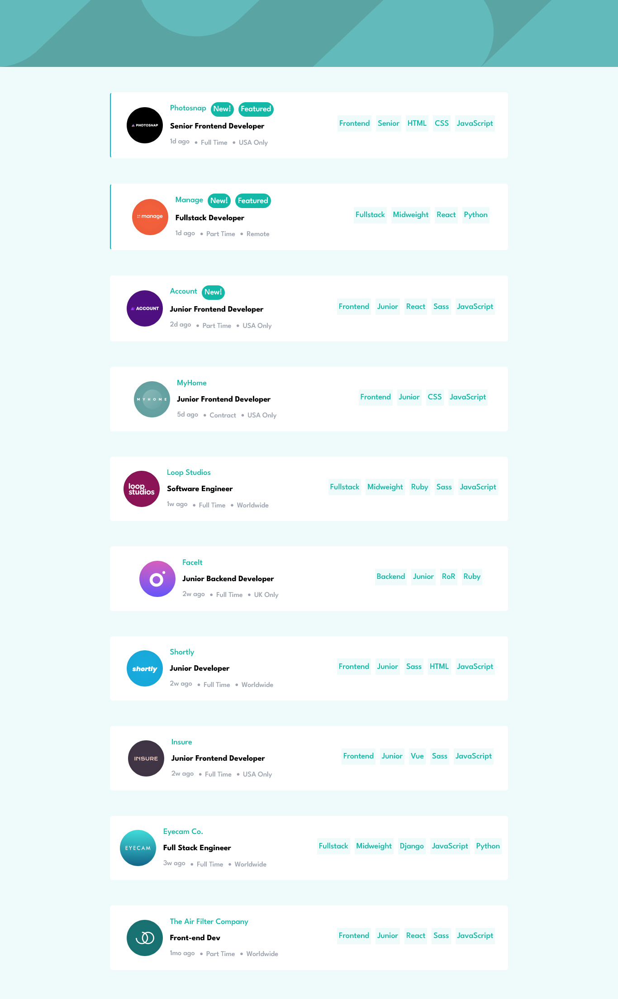
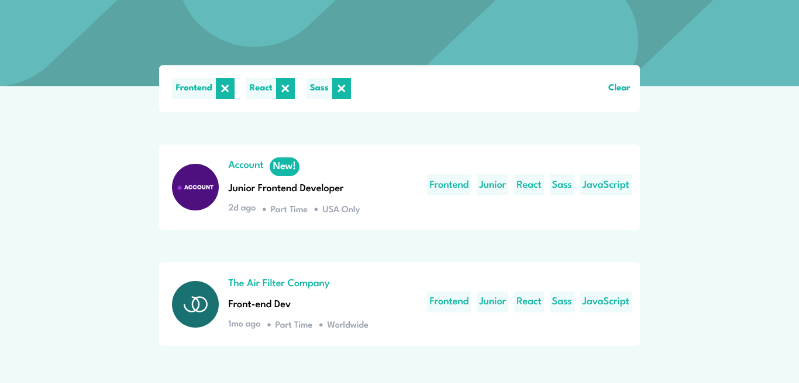
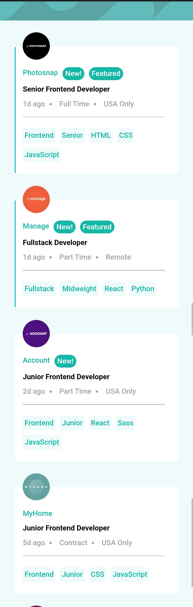
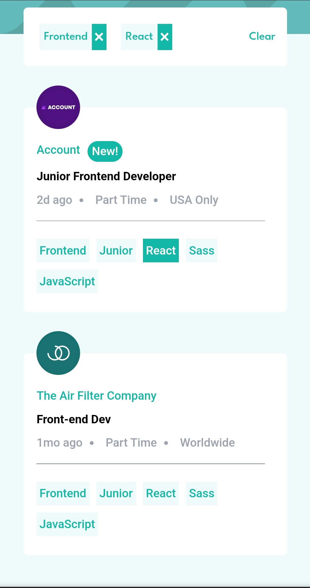

# Frontend Mentor - Job listings with filtering solution

This is a solution to the [Job listings with filtering challenge on Frontend Mentor](https://www.frontendmentor.io/challenges/job-listings-with-filtering-ivstIPCt). Frontend Mentor challenges help you improve your coding skills by building realistic projects.

## Table of contents

- [Overview](#overview)
  - [The challenge](#the-challenge)
  - [Screenshot](#screenshot)
  - [Links](#links)
- [My process](#my-process)
  - [Built with](#built-with)
  - [What I learned](#what-i-learned)
  - [Useful resources](#useful-resources)
- [Author](#author)

## Overview

### The challenge

Users should be able to:

- View the optimal layout for the site depending on their device's screen size
- See hover states for all interactive elements on the page
- Filter job listings based on the categories

### Screenshot

 

 

 

 

Add a screenshot of your solution. The easiest way to do this is to use Firefox to view your project, right-click the page and select "Take a Screenshot". You can choose either a full-height screenshot or a cropped one based on how long the page is. If it's very long, it might be best to crop it.

Alternatively, you can use a tool like [FireShot](https://getfireshot.com/) to take the screenshot. FireShot has a free option, so you don't need to purchase it.

Then crop/optimize/edit your image however you like, add it to your project, and update the file path in the image above.

### Links

- Solution URL: [Github](https://github.com/nitishkyadav7115/job-listing)
- Live Site URL: [Production Build](https://job-listing-xi-jet.vercel.app/)

## My process

### Built with

- [React](https://reactjs.org/) - JS library
- [Tailwind CSS](https://tailwindcss.com/) - For styles
- Flexbox
- Mobile-first workflow

### What I learned

While implementing this Project, I learned how to setup and use

- TailwindCSS
- Mobile First Design

### Useful resources

- [Tailwind CSS](https://tailwindcss.com/) - This helped me to look for predefined classes, styles, breakpoints and customization provided by Tailwind.

## Author

- Website - [Nitish Kumar Yadav](https://www.nitishkyadav.me)
- Frontend Mentor - [@nitishkyadav7115](https://www.frontendmentor.io/profile/nitishkyadav7115)
- Twitter - [@nitish_yadav5](https://www.twitter.com/nitish_yadav5)
